# OMReader
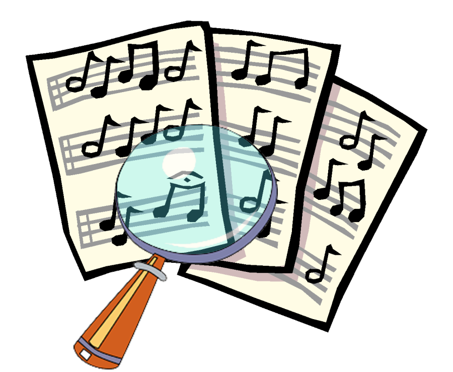</img>


[](https://github.com/MuhammeedAlaa/OMReader/graphs/contributors)

[](https://github.com/MuhammeedAlaa/OMReader/network/members)
[](https://github.com/MuhammeedAlaa/OMReader/stargazers)
[](https://github.com/MuhammeedAlaa/OMReader/blob/master/License)

## Table of Contents
- [Introduction](#About)
- [Assumptions](#Assumptions)
- [Supported Symbols](#Supported-Symbols)
- [Pipeline](#Pipeline)
  * [Preprocessing](#Preprocessing)
  * [Classification](#Classification)
- [Tools Used](#Tools-Used)
- [How to Run](#How-to-Run)
- [Useful Resources](#Useful-Resources)
- [Contributers](#Contributers)
- [License](#License)

## About

This project aims to convert music sheets into a machine-readable version. We take a simplified version as we support only main [symbols](#Supported-Symbols) where we convert an image of a music sheet to a textual representation that can be further processed to produce midi files or audio files like wav or mp3.

## Assumptions

- input image should be a scanned music sheet.
- maximum ledgers supported are `two` above the stafflines and `two` below the stafflines.
- each stave should start with a G clef.
- stem height is greater than or equal `3 * staffSpacing` (vertical area between two lines). 
- note head height equals `staffSpacing`.
- output file is in [GUIDO music notation](https://en.wikipedia.org/wiki/GUIDO_music_notation).

## Supported Symbols

Music sheets have a very vast variety of symbols making it hard to handle so for simplicity we handle only the symbols listed below.

### Notes
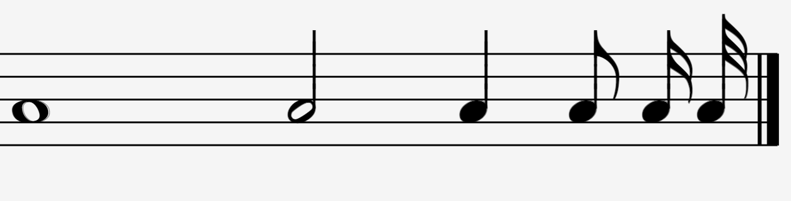
we support `whole notes`, `half notes`, `quarter notes`, `eigth notes`, `sixteenth notes`, `thiry-second notes` stemsUp or stemsDown.

### Beams
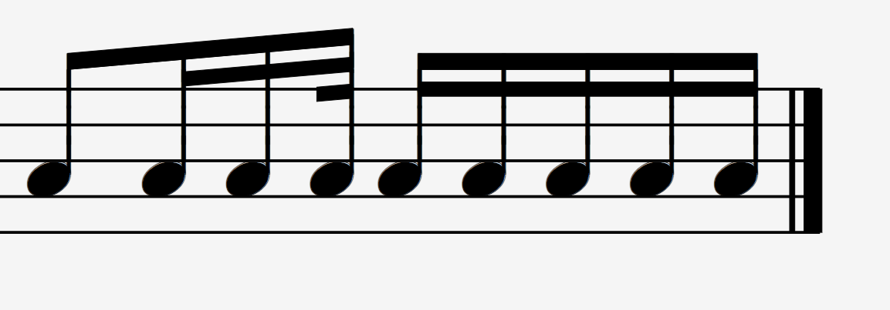
we support different kinds of beams combining notes up to `thirty-second` stemsUp or stemsDown.

### Chords
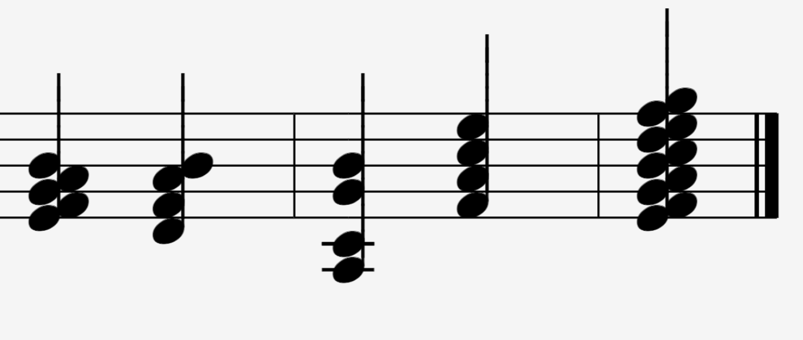
we support all kinds of chords.

### Special Symbols
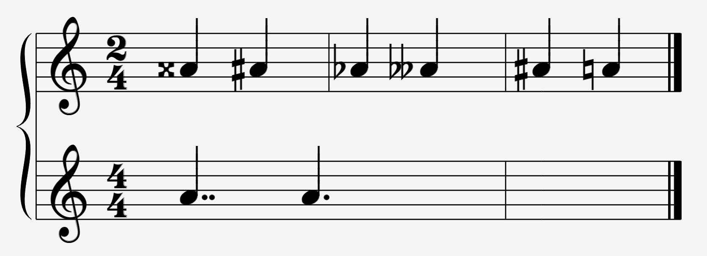
- **Time signatures**: we support only `4/2` and `4/4`
- **Accidentals**: we support all kinds like `double sharp`, `sharp`, `flat`, `double flat`, `natural`.
- **Augmentation dots**
- **clefs**: we support only G clef.

## Pipeline

### Preprocessing
- The input image goes through a series of steps we first apply filters to remove noise like `Hyprid Median Filter` and `Gaussian Filter` 
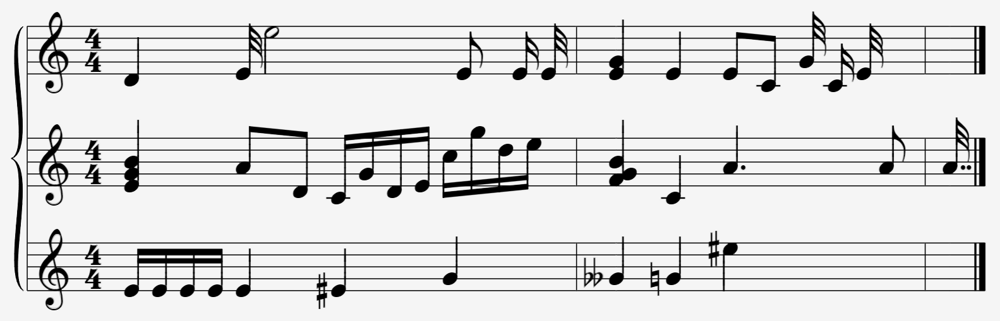
- We apply `Rotation` then `Adaptive Thresholding` is used to segment the image into symbols and background.
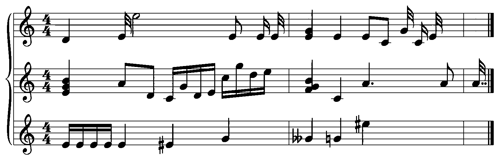

- We remove Stafflines to find the symbols in the image easier.
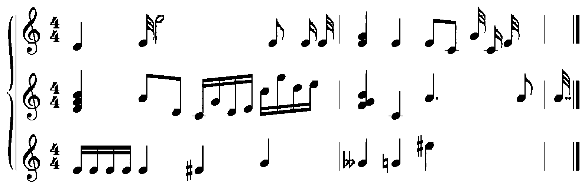

- We clip the image to remove the brace connecting the staves if exists.
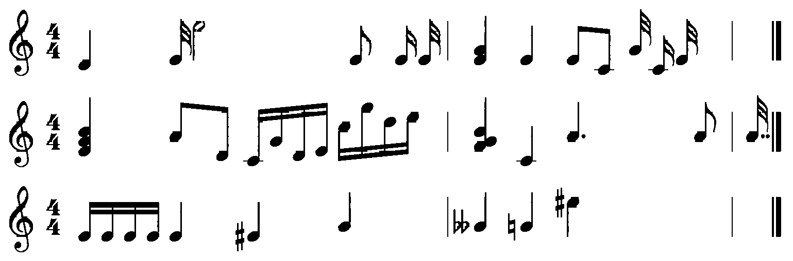

- We partition the image into the composing staves and apply find contours on each stave and feed each symbol to the classifiers.
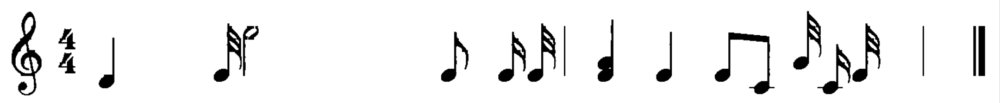
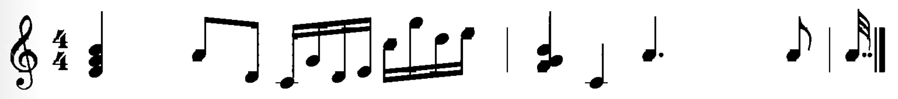
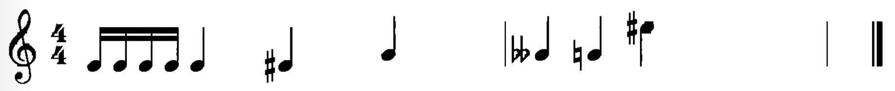

### Classification
- symbols are first fed into template matching using SIFT features to identify the following: `Double Sharp`, `Sharp`, `Flat`, `Double Flat`, `Natural`, `Whole Note`, `Time Signatures`.

- if non of the previous symbols was identified we begin classification with our algorithmic approach after removing the stems using the following decision tree.
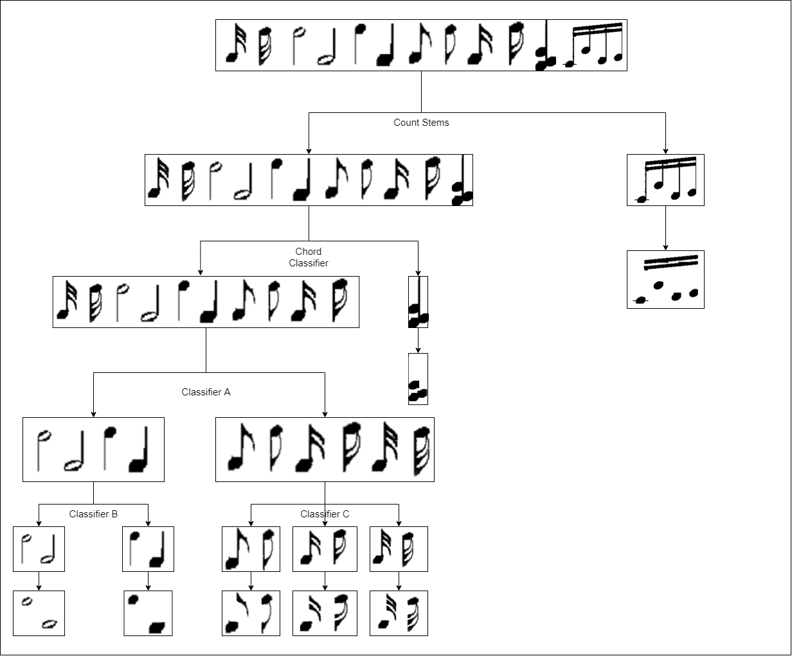

## Tools Used

- `Ubuntu-18.04` or `Ubuntu-18.04` installed on [WSL2](https://docs.microsoft.com/en-us/windows/wsl/install-win10)
- [vscode](https://code.visualstudio.com/)
- `python 3.8.5`
- `NumPy`
- `OpenCV`
- `scikit-image`

## How to Run
- Install [conda](https://www.anaconda.com/products/individual)
```
conda env create -f requirements.yml

conda activate OMReader

python3 main.py <input directory path> <output directory path>
```

**Note:** you can run it on windows but you should ignore creating environment with the command previously mentioned and you need to have `anaconda` and `opencv` installed.

## Useful Resources: 
- [Staff Line Removal](https://github.com/AmbitionXiang/2018_Competition_of_Computer_Design)
- [Classificaiton](https://www.researchgate.net/publication/263800032)
- [Guido Editor](https://guidoeditor.grame.fr/)


## Contributers:
- [Hossam Alaa](https://github.com/hossamalaa69)
- [Muhammed Ahmad Hesham](https://github.com/Etshawy1)
- [Muhammed Alaa](https://github.com/MuhammeedAlaa)
- [Mahmoud Gody](https://github.com/Moodrammer)

## License:
- Licensed under the [MIT License](./License).

